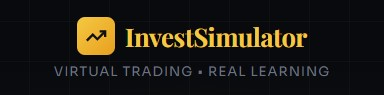
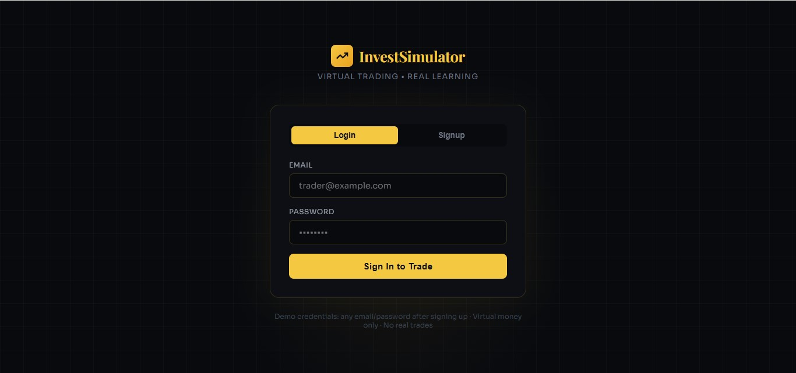
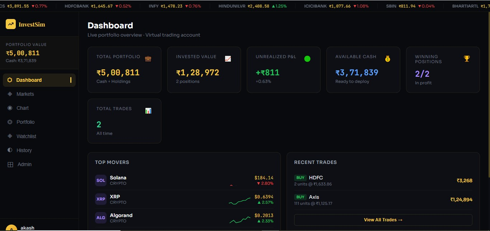
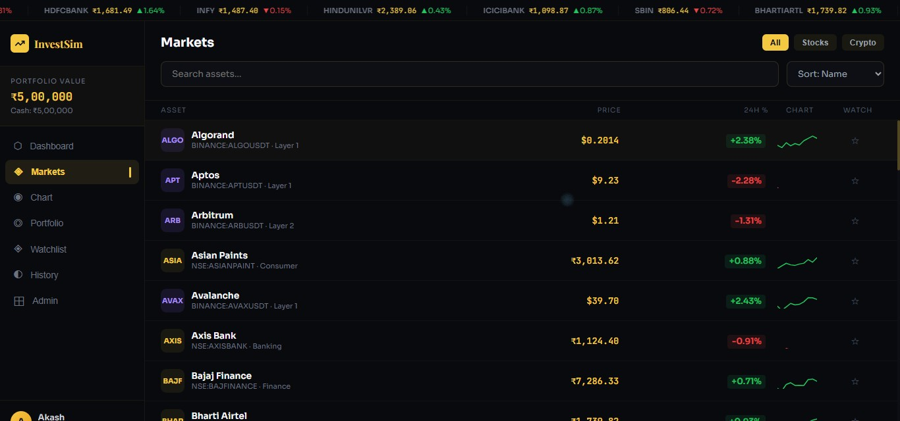
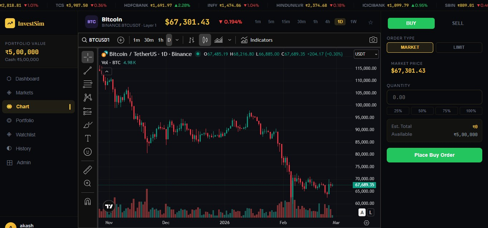

<div align="center">



[](https://react.dev)
[](https://vitejs.dev)
[](https://spring.io/projects/spring-boot)
[](https://mysql.com)
[](https://adoptium.net)
[](LICENSE)

**A production-grade educational trading simulator — Practice investing with virtual money using real market charts.**

[🚀 Live Demo](#) · [📖 Docs](#documentation) · [🐛 Report Bug](issues) · [💡 Request Feature](issues)

</div>

---

## ✨ Features

| Feature | Description |
|---------|-------------|
| 📊 **Live TradingView Charts** | Real NSE & Crypto charts with 9 timeframes |
| 💹 **Virtual Trading Engine** | Buy/Sell stocks & crypto with simulated capital |
| 🇮🇳 **Indian Stock Market** | Top 25 NSE stocks (Reliance, TCS, HDFC, Infosys...) |
| ₿ **Crypto Market** | Top 20 cryptocurrencies (BTC, ETH, SOL, BNB...) |
| 📈 **Portfolio Tracker** | Real-time P&L, allocation charts, cost basis |
| ⚡ **Live Price Engine** | Prices update every 3 seconds with volatility simulation |
| ⭐ **Watchlist** | Save and monitor favourite assets |
| 📜 **Trade History** | Full transaction ledger with realized P&L |
| 🔐 **JWT Authentication** | Secure login/signup with session management |
| 🛡️ **Admin Panel** | User management and system controls |
| 📱 **Responsive UI** | Works on desktop and mobile |

---

## 🖥️ Screenshots

> *Dark terminal-gold aesthetic inspired by Bloomberg Terminal & Zerodha Kite*


### 🔐 Authentication


---

### 📊 Trading Dashboard


---

### 📈 Live Trading Interface


---

### 💼 Chart & PnL Tracking


---

## 🏗️ Architecture

```
invest-simulator/
├── frontend/               # React 18 + Vite SPA
│   ├── src/
│   │   ├── App.jsx         # Main application (all-in-one)
│   │   └── main.jsx        # Entry point
│   ├── index.html
│   ├── vite.config.js
│   └── package.json
│
├── backend/                # Spring Boot 3.2 REST API
│   └── src/main/
│       ├── java/com/investsimulator/
│       │   ├── model/      # JPA Entities
│       │   ├── dto/        # Request/Response objects
│       │   ├── repository/ # JPA Repositories
│       │   ├── service/    # Business logic
│       │   ├── controller/ # REST endpoints
│       │   └── security/   # JWT + Spring Security
│       └── resources/
│           └── application.properties
│
├── database/
│   └── schema.sql          # MySQL schema + seed data
│
├── docker-compose.yml      # Full stack Docker setup
├── .gitignore
└── README.md
```

---

## 🚀 Quick Start

### Option 1 — Frontend Only (5 minutes, no backend needed)

```bash
# 1. Clone the repo
git clone https://github.com/akashsuryawanshi04/invest-simulator.git
cd invest-simulator/frontend

# 2. Install dependencies
npm install

# 3. Start development server
npm run dev

# 4. Open browser
# → http://localhost:5173
```

> ✅ The frontend works **completely standalone** using localStorage. No database needed!

---

### Option 2 — Full Stack with Docker (one command)

```bash
# Clone and run everything
git clone https://github.com/akashsuryawanshi04/invest-simulator.git
cd invest-simulator

docker-compose up -d

# Frontend → http://localhost:5173
# Backend  → http://localhost:8080
# MySQL    → localhost:3306
```

---

### Option 3 — Manual Full Stack Setup

See → **[docs/SETUP_GUIDE.md](docs/SETUP_GUIDE.md)** for detailed step-by-step instructions.

---

## 🔌 API Endpoints

| Method | Endpoint | Auth | Description |
|--------|----------|------|-------------|
| POST | `/api/auth/signup` | ❌ | Create account |
| POST | `/api/auth/login` | ❌ | Login + get JWT |
| GET | `/api/market/assets` | ❌ | All stocks & crypto |
| GET | `/api/market/prices` | ❌ | Live simulated prices |
| POST | `/api/trade/execute` | ✅ | Buy or sell asset |
| GET | `/api/portfolio` | ✅ | Portfolio summary |
| GET | `/api/portfolio/history` | ✅ | Trade history |
| GET | `/api/portfolio/watchlist` | ✅ | User watchlist |
| POST | `/api/portfolio/watchlist/{id}` | ✅ | Toggle watchlist |
| GET | `/api/admin/users` | 🔒 | All users (admin) |
| PUT | `/api/admin/users/{id}/reset` | 🔒 | Reset balance (admin) |

---

## 🛠️ Tech Stack

### Frontend
- **React 18** — UI framework
- **Vite 5** — Build tool
- **TradingView Widget** — Real market charts
- **useReducer** — State management
- **localStorage** — Client-side persistence
- **CSS-in-JS** — Inline styles (zero dependencies)

### Backend
- **Spring Boot 3.2** — REST API framework
- **Spring Security** — Authentication & authorization
- **Spring Data JPA** — Database ORM
- **JWT (JJWT 0.11)** — Token-based auth
- **BCrypt** — Password hashing
- **Lombok** — Boilerplate reduction
- **MySQL 8.0** — Relational database
- **HikariCP** — Connection pooling
- **@Scheduled** — Price simulation engine

---

## 🗄️ Database Schema

```sql
users          → Authentication & virtual wallet
assets         → NSE stocks & cryptocurrencies
holdings       → User positions (qty + avg price)
transactions   → Full trade ledger
portfolios     → Aggregated P&L per user
watchlist      → Saved assets per user
price_history  → Historical simulated prices
user_sessions  → JWT token management
```

---

## ⚙️ Environment Variables

### Backend (`application.properties`)
```properties
spring.datasource.url=jdbc:mysql://localhost:3306/invest_simulator
spring.datasource.username=root
spring.datasource.password=YOUR_PASSWORD
app.jwt.secret=YOUR_256_BIT_SECRET_KEY
app.jwt.expiration-ms=86400000
```

### Frontend (`.env`)
```env
VITE_API_BASE_URL=http://localhost:8080/api
```

---

## 🧪 Test Accounts

After setup, create an account via the UI or use the API:

```bash
curl -X POST http://localhost:8080/api/auth/signup \
  -H "Content-Type: application/json" \
  -d '{"fullName":"Test Trader","email":"trader@test.com","password":"test123","initialCapital":500000}'
```

---

## 📁 Key Files Explained

| File | Purpose |
|------|---------|
| `frontend/src/App.jsx` | Entire React app — login, dashboard, charts, trading |
| `database/schema.sql` | MySQL tables, stored procedures, triggers, seed data |
| `backend/src/.../TradingService.java` | Atomic buy/sell logic with balance checks |
| `backend/src/.../PriceSimulationService.java` | Price engine with random-walk algorithm |
| `backend/src/.../SecurityConfig.java` | JWT + CORS + RBAC configuration |
| `docker-compose.yml` | Full stack container orchestration |

---

## 🔒 Security Features

- ✅ JWT stateless authentication
- ✅ BCrypt password hashing (strength 12)
- ✅ SQL injection protection via JPA parameterized queries
- ✅ CORS restricted to allowed origins
- ✅ Bean Validation on all inputs
- ✅ Role-based access control (USER / ADMIN)
- ✅ No real trading APIs — purely educational simulation

---

## 🗺️ Roadmap

- [x] Core trading simulation engine
- [x] TradingView chart integration
- [x] Portfolio P&L tracking
- [x] Watchlist feature
- [x] Admin panel
- [ ] WebSocket real-time price push
- [ ] Leaderboard / social trading
- [ ] Limit & stop-loss orders
- [ ] Options simulation
- [ ] Portfolio analytics (Sharpe ratio, beta)
- [ ] Mobile app (React Native)

---

## 🤝 Contributing

1. Fork the repository
2. Create your feature branch: `git checkout -b feature/add-leaderboard`
3. Commit changes: `git commit -m 'feat: add leaderboard feature'`
4. Push to branch: `git push origin feature/add-leaderboard`
5. Open a Pull Request

---

## 📄 License

Distributed under the MIT License. See [LICENSE](LICENSE) for more information.

---

## ⚠️ Disclaimer

> InvestSimulator is an **educational tool only**. It does NOT execute real trades, connect to real brokerage accounts, or use real money. All prices shown for trading purposes are **simulated**. The TradingView charts display real market data for educational visualization only. This platform is not financial advice.

---

<div align="center">
Built for learning investing without financial risk 📚
</div>
